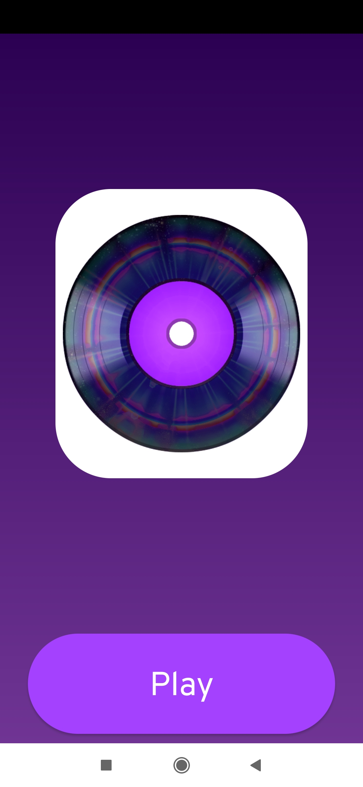
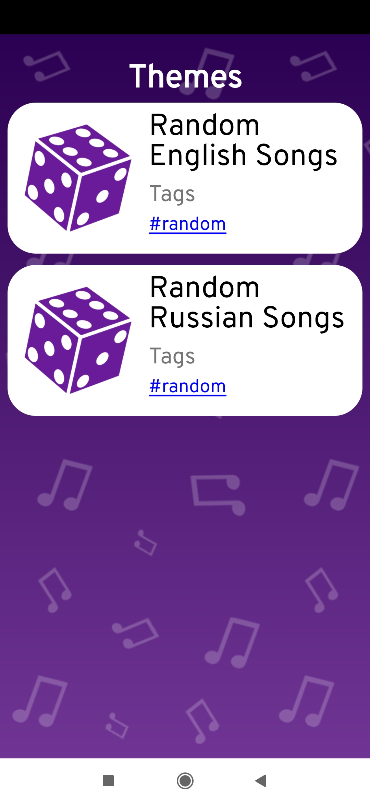
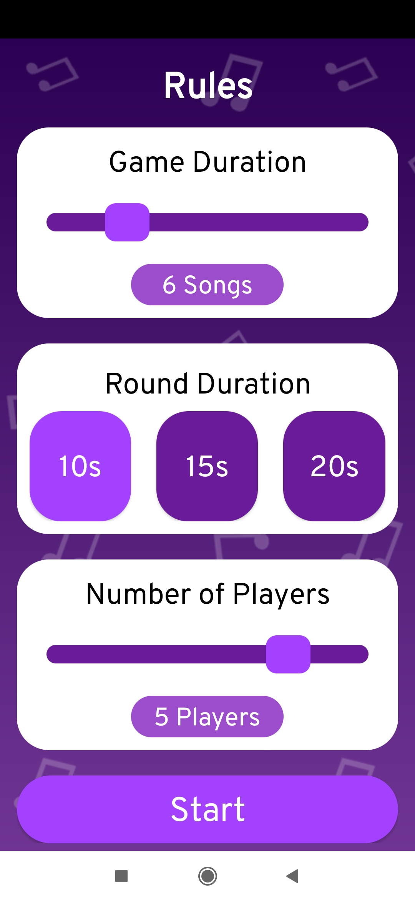
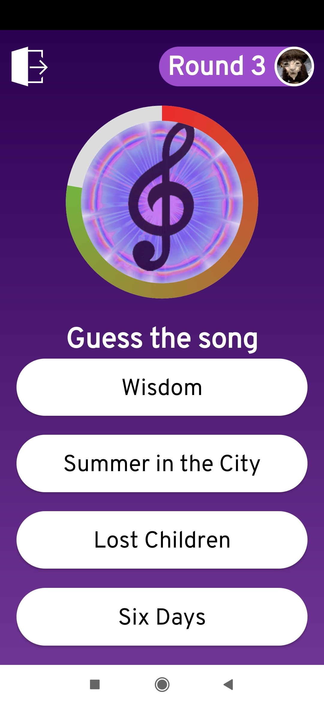
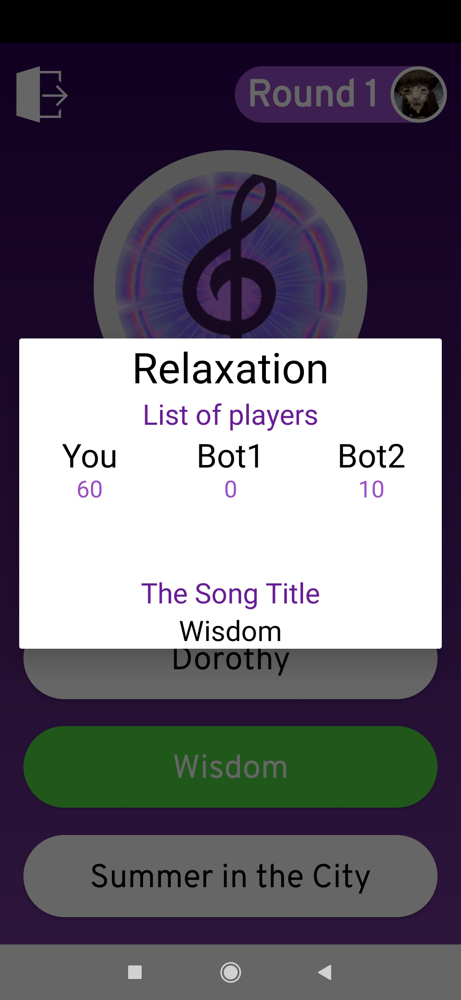
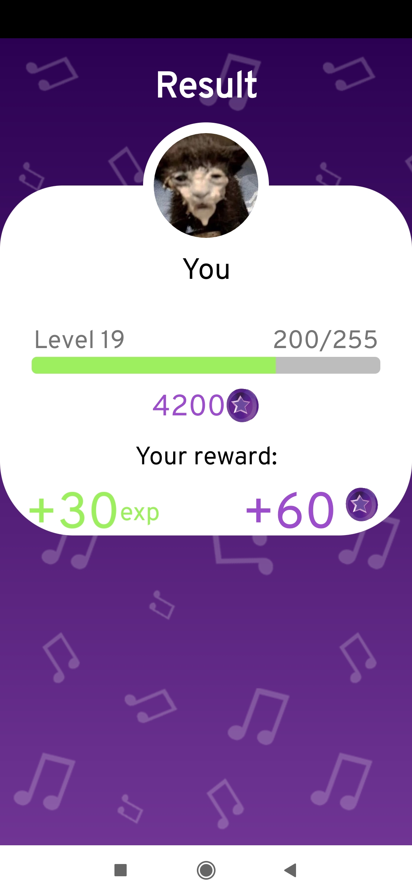

# trpp_MusicQuiz
<h1 align="center">Музыкальаня викторина</h1>

<h1 align="center">Состав команды</h1>
<ul>
    <li>Выборнов А. Д.</li>
    <li>Абдусалямова С. К.</li>
</ul>

<h1 align="center">Описание проекта</h1>

Данное приложение было реализовано, как итоговый проект для предмета ТРПП (Технология разработки программных приложений)

Приложение представляет из себя (ВСТАВЬТЕ ТЕКСТ СЮДА) 

    
 

(ВСТАВЬТЕ ТЕКСТ СЮДА) 

<h1 align="center">Зависимости, используемые в проекте</h1>

dependencies {
    
    
    implementation 'androidx.appcompat:appcompat:1.4.1'
    implementation 'com.android.support.constraint:constraint-layout:2.0.4'
    testImplementation 'junit:junit:4.13.2'
    androidTestImplementation 'com.android.support.test:runner:1.0.2'
    androidTestImplementation 'com.android.support.test.espresso:espresso-core:3.0.2'
    implementation 'com.google.android.material:material:1.5.0'
    implementation "androidx.lifecycle:lifecycle-extensions:2.2.0"
    annotationProcessor "androidx.lifecycle:lifecycle-compiler:2.4.1"
}

<h1 align="center">Запуск проекта</h1>

Для запуска проекта необходимо скачать репозиторий, распакавать его, после чего открыть с помощью программы Android Studios. Внутри программы необходимо открыть папку с проектом и нажать кнопку "Run"

<h1 align="center"> Итоги </h1>

В итоге (ВСТАВЬТЕ ТЕКСТ ПЛЗ).

